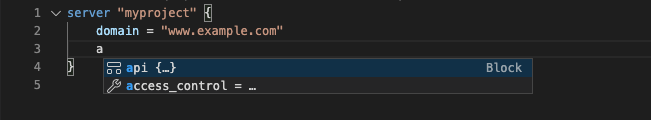
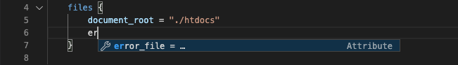
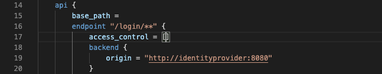

# Couper Configuration Extension for Visual Studio Code
This extension adds Couper-specific highlighting and autocompletion to [Couper's configuartion file](https://github.com/avenga/couper/tree/master/docs#conf_file) couper.hcl in Visual Studio Code.
## Features
### Attributes and Blocks
Select from all Couper-specific attributes and blocks.

### Types and Values
Automatically choose the right type or value for Couper-specific attributes. 

### Handy Configuration 
Easy input for mandatory labels. The cursor jumps directly to the necessary spot. 

## Setup
    make install
## About Couper
[Couper](https://github.com/avenga/couper) is a frontend gateway especially designed to support building and running API-driven Web projects. Acting as a proxy component it connects clients with (micro) services and adds access control and observability to the project. 